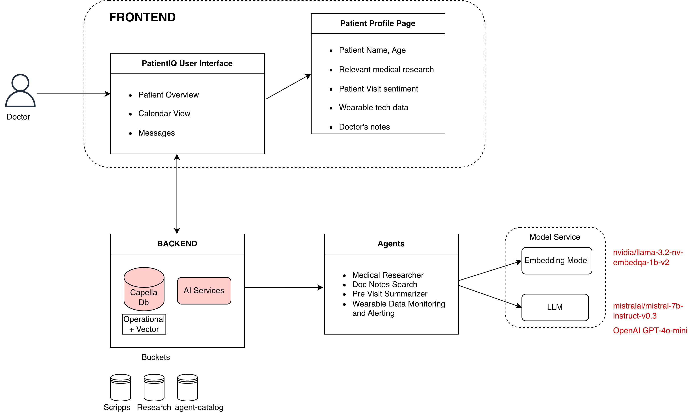
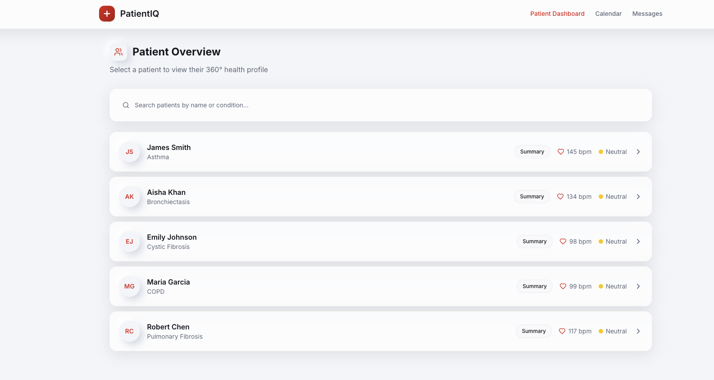
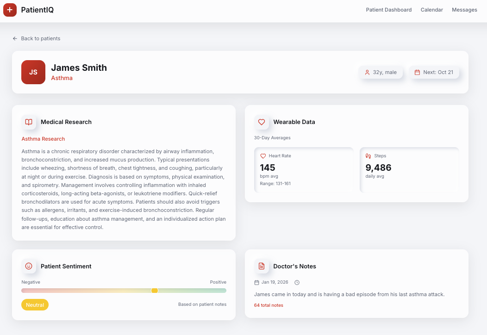
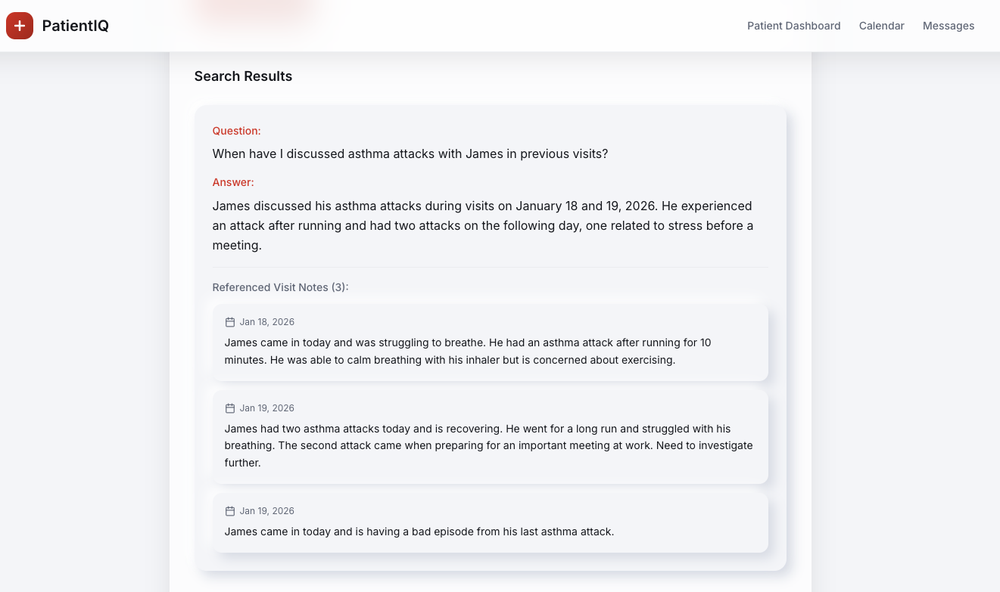
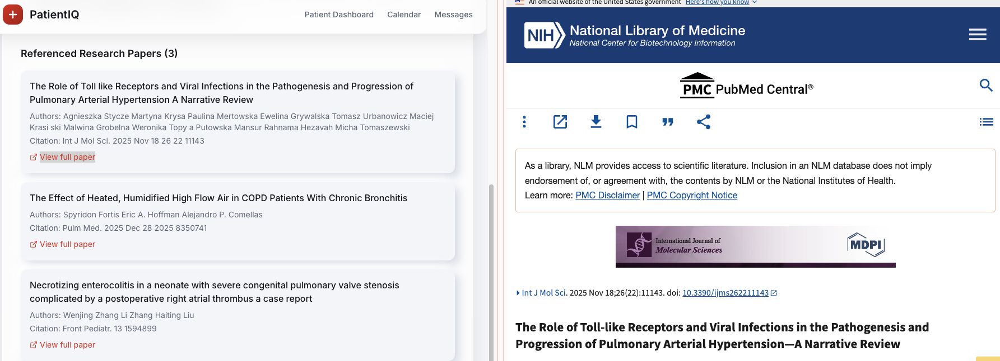
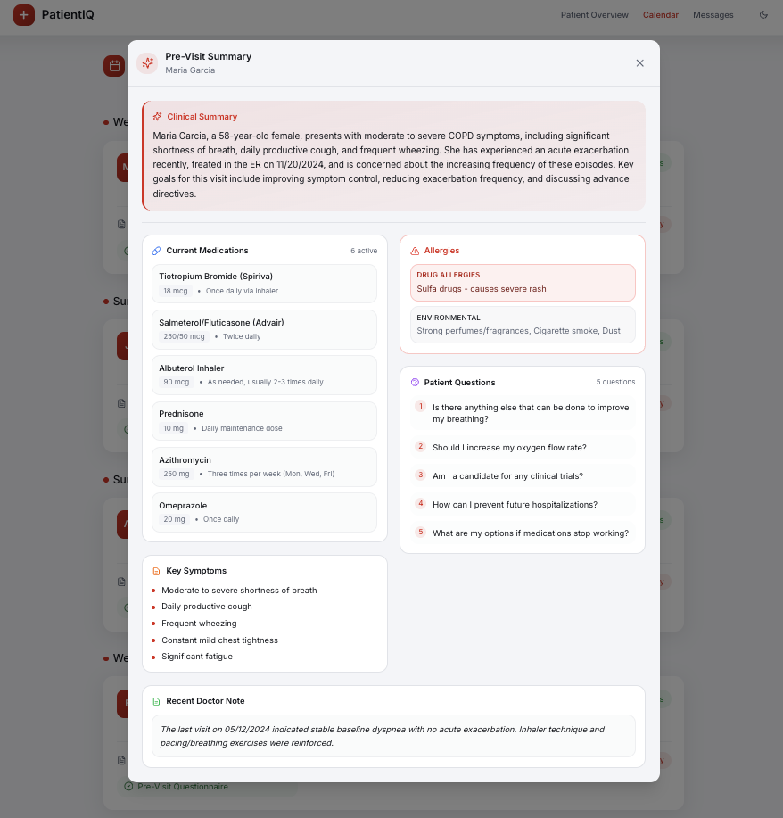
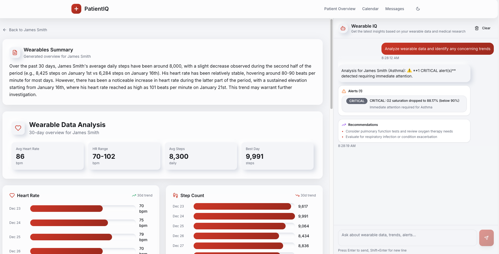

# PatientIQ - Agentic Patient 360

## Team Name: Latent Potential
## App Name: PatientIQ

## One Liner
PatientIQ centralizes patient data and minimizes a doctor's cognitive load by making intelligent micro decisions, freeing up more space for the life saving ones made by the experts.

## Abstract
Doctors today face countless daily micro decisions, many of which are administrative and pull focus away from life saving care. PatientIQ centralizes key patient information and uses AI agents to handle routine information retrieval, giving clinicians more time to focus on analysis and delivery of patient care.

## The Core Problem
Doctors face countless daily micro decisions, many of which are administrative and pull focus away from life-saving care. The constant need to search through patient records, research literature, and past visit notes creates significant cognitive load that reduces time available for actual patient care.

## How PatientIQ Solves It
PatientIQ addresses this through a three-tier architecture that combines:
1. Data Centralization - Brings together patient demographics, clinical notes, wearable data, questionnaires, and medical research papers into a single system.
2. AI Agent Automation - Uses specialized agents to handle routine information retrieval:
    - pulmonary_research_agent searches medical literature for treatment options and evidence.
    - docnotes_search_agent searches past visit notes to jog a doctor's memory.
    - previsit_summarizer_agent summarizes pre-visit questionnaires.
    - wearable_alerting_agent monitors wearable data for concerning trends.
3. Intelligent Decision Support - Provides AI-powered summaries and semantic search to help clinicians make faster, more informed decisions.

The result is that clinicians can focus on analysis and patient care rather than administrative tasks and information retrieval.

## High Level Architecture

## Screenshots
### PatientIQ Home

### PatientIQ Dashboard

## Run
- `make dev`
- `make stop`

## Code Formatting
- Install hooks:
  - `make install-hooks`

## Agents
See: `/agents/AGENTS.md`

### Docnotes Search Agent

### Pulmonary Researcher Agent

### Previsit Summarizer Agent

### Wearable Analysis and Alerting Agent

## Documentation
- **DeepWiki**: https://deepwiki.com/wooyakob/PatientIQ
- **Agents**: `/agents/AGENTS.md`
- **API**: `/docs/api` (open with `open docs/api/index.html`)

### Cluster Configuration
Cluster used for testing (high level):
- AWS US East
- Couchbase Server `8.0`
- 5 nodes total
- Data service group: 3 nodes
- Index/Query/Search/Eventing group: 2 nodes
- MultiAZ required for AI Functions to work
- Private Networking Enabled for Workflows, Embedding Model to Work

### Database Schema
Configured via environment variables:
- `COUCHBASE_BUCKET` (defaults to `Scripps`)
- `COUCHBASE_RESEARCH_BUCKET` (defaults to `Research`)

#### Research (bucket)
- **Pubmed** (scope)
  - `Pulmonary` (collection)
  - `questions` (collection)
  - `answers` (collection)

#### Scripps (bucket)
- **Notes** (scope)
  - `Doctor` (collection)
  - `Patient` (collection)
  - `doctors_questions` (collection)
  - `answers_doctors` (collection)
  - `patient_notes_sentiment_analysis` (collection)
  - `patient_masked` (collection)
- **People** (scope)
  - `Doctors` (collection)
  - `Patients` (collection)
- **Wearables** (scope)
  - `Patient_1` (collection)
  - `Patient_2` (collection)
  - `Patient_3` (collection)
  - `Patient_4` (collection)
  - `Patient_5` (collection)
- **Questionnaires** (scope)
  - `patient_1` (collection)
  - `patient_2` (collection)
  - `patient_3` (collection)
  - `patient_4` (collection)
  - `patient_5` (collection)
- **Messages** (scope)
  - `Private` (collection)
  - `Public` (collection)
- **Calendar** (scope)
  - `Appointments` (collection)

#### Agent Catalog (bucket)
- `agent_catalog`
  - `metadata`
  - `prompts`
  - `tools`
- `agent_activity`
  - `logs`

## Cluster Cost Estimate

**Window**
- **Feb 8–12**
- **Feb 12:** cluster destroyed

**Assumptions used in this estimate**
- **Weekdays (Mon–Fri):** 9am–noon (3 hours/day)
- **Weekend:** Sat/Sun off
- **Rate (on):** 2.77
- **Rate (off):** 0.16

**Weekly estimate**
| Category | Calculation | Weekly hours | Cost |
| --- | --- | ---: | ---: |
| On time | 3 hours/day × 5 days | 15 | $41.55 |
| Off time | (21 hours × 5 days) + (24 hours × 2 days) | 153 | $24.48 |
| **Total** |  |  | **$66.03** |

**Projected total (3–4 weeks):** $198.09